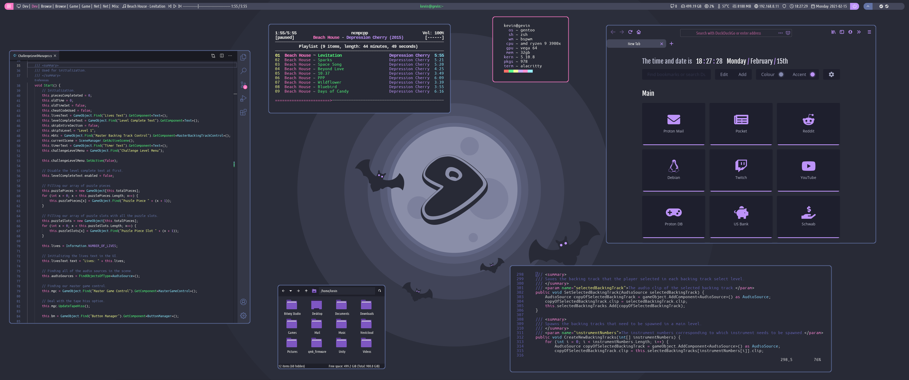

# dotfiles

## polybar

My polybar files are based on the "polybar-4" theme from this repo:
https://github.com/adi1090x/polybar-themes. If you wish to recreate my polybar
look, you can either use this theme or my files as a starting point. My files
will have most of the things taken out that aren't used directly in my polybar,
so keep that in mind if you want to add things that aren't in my bar.

To get started, copy the contents of the `polybar` directory into:
`~/.config/polybar`

### fonts

I use the Ubuntu Condensed for the main font, and icomoon-feather for the icon
font. These can be found in the `fonts` directory, and should be added to your
system fonts to be useable. I copy mine into `/usr/share/fonts`, then run
`fc-cache -f -v`.

### scripts

`kde-virtual-desktops`, `kde-next-desktop`, and `kde-previous-desktop` are the
scripts I use for virtual desktop interaction in the polybar. Instructions on
how to use these scripts can be found in the repo I made for them here:
https://gitlab.com/KevinNThomas/kde-virtual-desktops-polybar

### colors

Colors can be configured in `colors.ini`, and can be accessed using the form:
`${color.background}`.

### config

I use two configuration files: `config-primary.ini` and `config-secondary.ini`
because I use a dual monitor setup. See comments inside the files for more
in-depth descriptions of the various sections.

### modules

Contains configs for modules built into polybar

### user_modules

Contains modules created by me. This is also where I recommend adding your own
custom modules.

### launching

My `launch.sh` is configured to launch both bars, one on each of my monitors, so
edit the script for what fits your need.

Make sure `launch.sh` is executable by running: `chmod +x launch.sh`.
Add `launch.sh` as a startup script so polybar launches every time you log in.

## firefox

Theme is based on
[minimal-function-fox](https://github.com/mut-ex/minimal-functional-fox).
See the README of that repo for how to get it setup. I only ended up using the
userChrome.css and userContent.css files for my setup.

Install the [nightTab](https://addons.mozilla.org/en-US/firefox/addon/nighttab/)
extension to get the new tab page shown in my screenshot.

## vscode

### extensions

Install the Dracula extension. I also use the
[Customize UI](https://marketplace.visualstudio.com/items?itemName=iocave.customize-ui)
extension to remove some things you can't remove normally.

### settings.json

Contains the relevant parts of my `settings.json` file.

